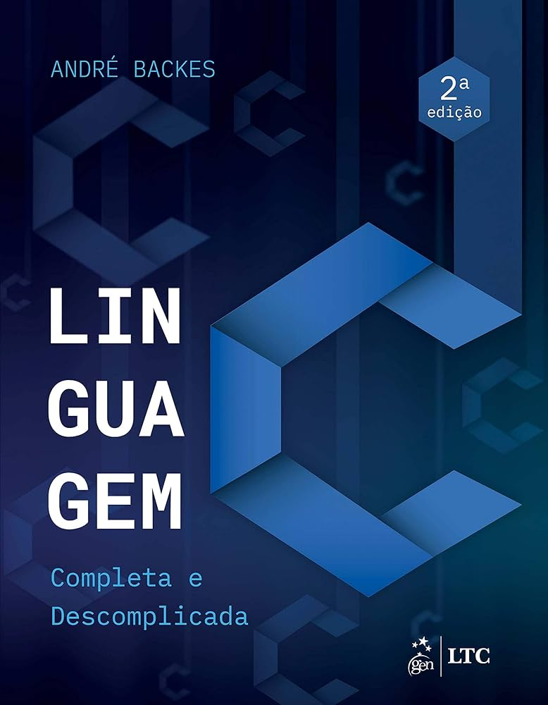
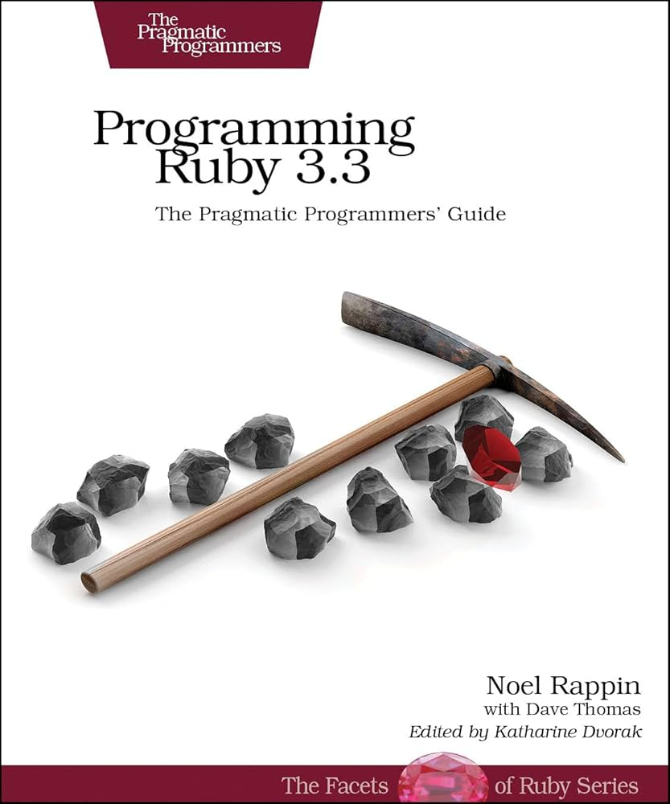
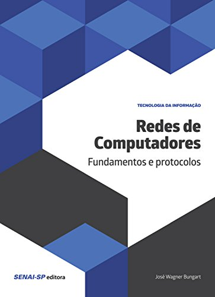
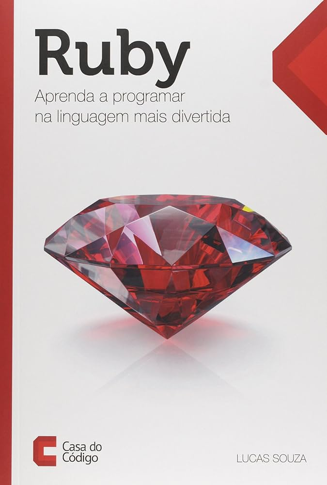
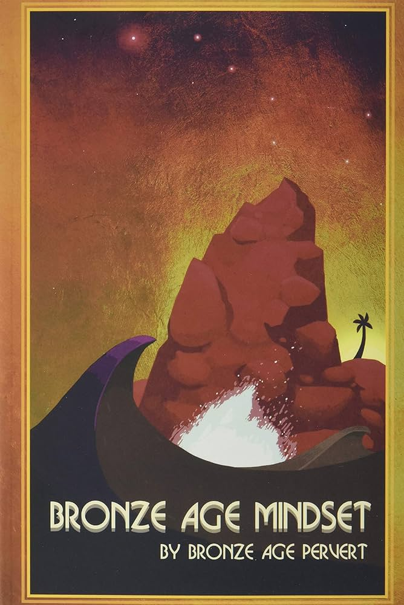

# Biblioteca de Livros de Gabriel Lopes

Bem-vindo à nossa biblioteca de livros em PDF. Este repositório contém uma coleção de livros sobre programação e outros temas interessantes. Sinta-se à vontade para explorar e aprender com esses recursos valiosos.

## 📚 Livros Disponíveis

### 1. Linguagem C: Completa e Descomplicada



**Sinopse:**
Este livro oferece uma introdução abrangente à linguagem de programação C. Ideal para iniciantes e programadores experientes, ele cobre desde os conceitos básicos até tópicos avançados, proporcionando uma compreensão completa da linguagem.

### 2. O Programador Pragmático


**Sinopse:**
Um clássico essencial para qualquer desenvolvedor. Este livro ensina práticas pragmáticas para melhorar suas habilidades de programação e abordar problemas complexos de maneira eficaz. Cheio de conselhos práticos e exemplos do mundo real.

### 3. Programming Ruby 3.2 Pickaxe



**Sinopse:**
Conhecido como "O Pickaxe", este livro é a referência definitiva para a linguagem Ruby. Abrange tudo, desde os fundamentos da linguagem até as bibliotecas padrão, com exemplos claros e concisos.

### 4. Redes de Computadores



**Sinopse:**
Um guia completo sobre redes de computadores, cobrindo tópicos desde a teoria básica até a implementação prática. Ideal para estudantes de ciência da computação e profissionais de TI que desejam aprofundar seus conhecimentos em redes.

### 5. Ruby: Aprenda a Programar na Linguagem Mais Divertida



**Sinopse:**
Este livro torna o aprendizado de Ruby divertido e acessível. Com exemplos práticos e exercícios, você aprenderá a programar nesta linguagem dinâmica e poderosa enquanto se diverte.

### 6. Bronze Age Pervert



**Sinopse:**
Um livro provocativo e controverso que explora ideias sobre a sociedade moderna e a cultura. Não é um livro de programação, mas oferece uma leitura instigante sobre temas filosóficos e culturais.

## 📂 Como Baixar os Livros

Para baixar os livros, siga as instruções abaixo:

1. Clone este repositório:
   ```sh
   git clone https://github.com/Gabriel-Lopees/Books.git
